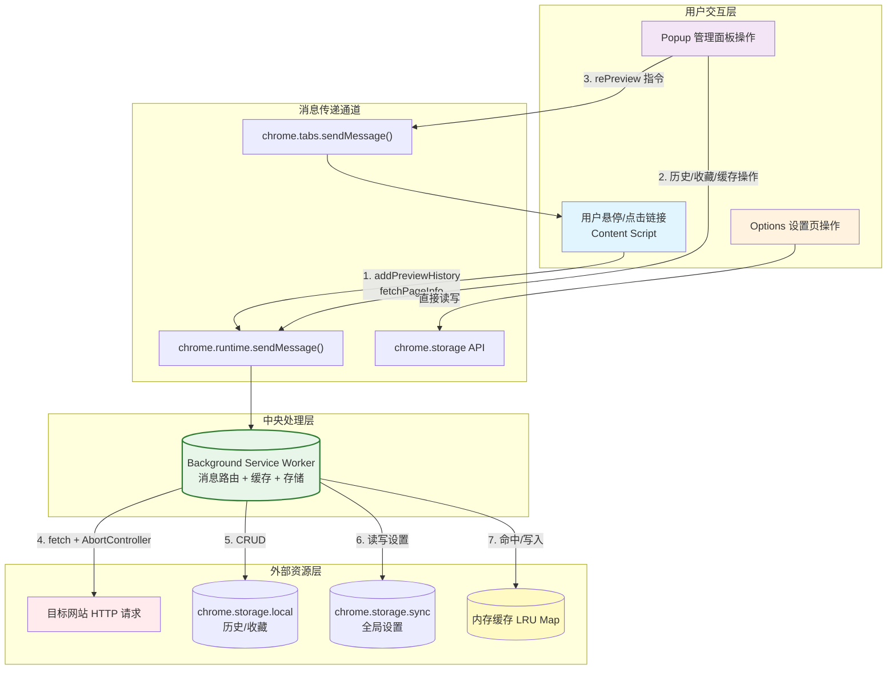
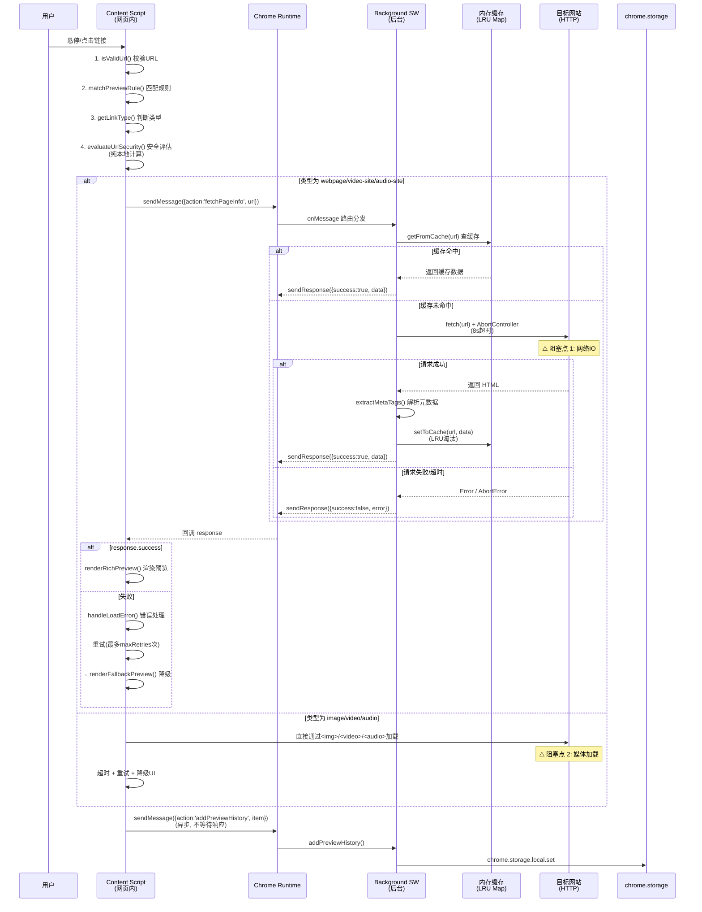
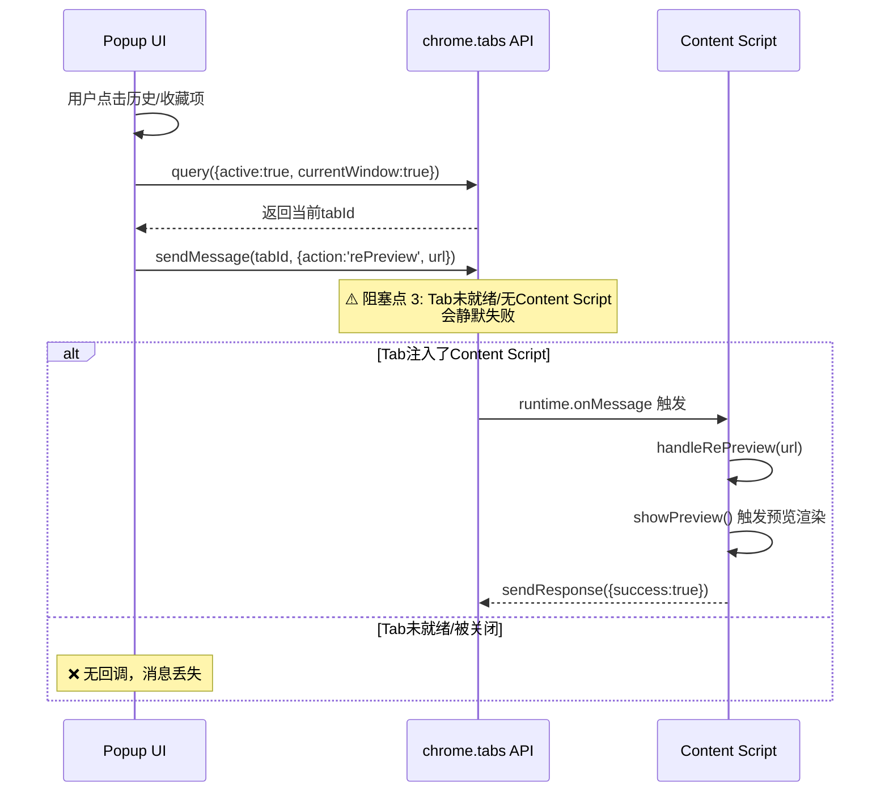
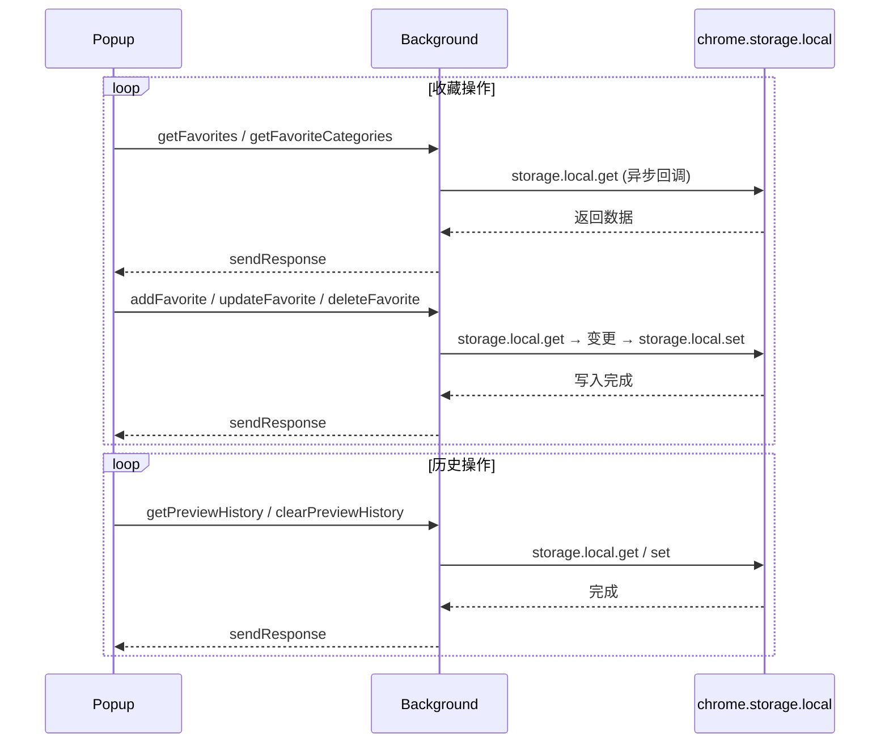
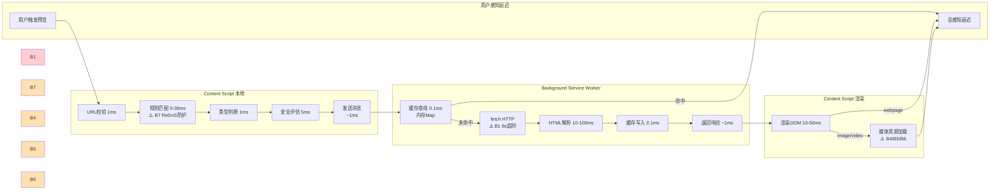
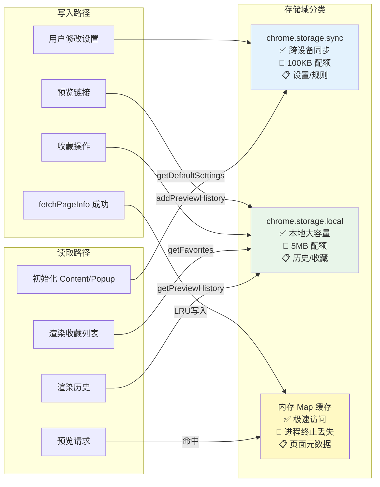

# QuickLink Preview 浏览器插件消息流分析文档

## 一、架构概览

本扩展采用 Chrome Manifest V3 标准架构，包含以下四层模块：

| 层级 | 文件路径 | 角色定位 | 运行环境 |
|------|---------|---------|---------|
| Content Script | [content.js](file:///Users/tog/Desktop/code/solo/xyj-132/content/content.js) | 注入页面，处理用户交互与预览渲染 | 宿主网页上下文 |
| Background Service Worker | [background.js](file:///Users/tog/Desktop/code/solo/xyj-132/background/background.js) | 中央消息枢纽、网络请求、缓存、存储管理 | 扩展后台独立上下文 |
| Popup UI | [popup.js](file:///Users/tog/Desktop/code/solo/xyj-132/popup/popup.js) | 工具栏弹窗，管理历史/收藏/设置 | 扩展独立弹窗上下文 |
| Options Page | [options.html](file:///Users/tog/Desktop/code/solo/xyj-132/options/options.html) | 独立设置页（简化版设置） | 扩展独立标签页上下文 |

---

## 二、消息流传递路径总览

### 2.1 总体架构流程图



### 2.2 完整消息动作清单

| 消息 Action | 发起方 | 接收方 | 返回值 | 同步/异步 | 关键代码 |
|-------------|-------|-------|--------|----------|---------|
| `fetchPageInfo` | Content/Popup | Background | `{success, data}` | 异步(Promise) | [background.js#L663-L671](file:///Users/tog/Desktop/code/solo/xyj-132/background/background.js#L663-L671) |
| `fetchPageSnapshot` | Content/Popup | Background | `{success, data}` | 异步(Promise) | [background.js#L674-L682](file:///Users/tog/Desktop/code/solo/xyj-132/background/background.js#L674-L682) |
| `addPreviewHistory` | Content | Background | `{success}` | 同步 | [background.js#L685-L689](file:///Users/tog/Desktop/code/solo/xyj-132/background/background.js#L685-L689) |
| `getPreviewHistory` | Popup | Background | `{success, data}` | 异步(Callback) | [background.js#L691-L696](file:///Users/tog/Desktop/code/solo/xyj-132/background/background.js#L691-L696) |
| `clearPreviewHistory` | Popup | Background | `{success}` | 异步(Callback) | [background.js#L698-L703](file:///Users/tog/Desktop/code/solo/xyj-132/background/background.js#L698-L703) |
| `deletePreviewHistoryItem` | Popup | Background | `{success, data}` | 异步(Callback) | [background.js#L705-L710](file:///Users/tog/Desktop/code/solo/xyj-132/background/background.js#L705-L710) |
| `getFavoriteCategories` | Popup | Background | `{success, categories}` | 异步(Callback) | [background.js#L712-L717](file:///Users/tog/Desktop/code/solo/xyj-132/background/background.js#L712-L717) |
| `addFavoriteCategory` | Popup | Background | `{success, category}` | 异步(Callback) | [background.js#L719-L724](file:///Users/tog/Desktop/code/solo/xyj-132/background/background.js#L719-L724) |
| `updateFavoriteCategory` | Popup | Background | `{success, category}` | 异步(Callback) | [background.js#L726-L731](file:///Users/tog/Desktop/code/solo/xyj-132/background/background.js#L726-L731) |
| `deleteFavoriteCategory` | Popup | Background | `{success}` | 异步(Callback) | [background.js#L733-L738](file:///Users/tog/Desktop/code/solo/xyj-132/background/background.js#L733-L738) |
| `getFavorites` | Popup | Background | `{success, favorites}` | 异步(Callback) | [background.js#L740-L745](file:///Users/tog/Desktop/code/solo/xyj-132/background/background.js#L740-L745) |
| `getFavoritesByCategory` | Popup | Background | `{success, favorites}` | 异步(Callback) | [background.js#L747-L752](file:///Users/tog/Desktop/code/solo/xyj-132/background/background.js#L747-L752) |
| `addFavorite` | Content/Popup | Background | `{success, item}` | 异步(Callback) | [background.js#L754-L759](file:///Users/tog/Desktop/code/solo/xyj-132/background/background.js#L754-L759) |
| `updateFavorite` | Popup | Background | `{success, item}` | 异步(Callback) | [background.js#L761-L766](file:///Users/tog/Desktop/code/solo/xyj-132/background/background.js#L761-L766) |
| `deleteFavorite` | Popup | Background | `{success, count}` | 异步(Callback) | [background.js#L768-L773](file:///Users/tog/Desktop/code/solo/xyj-132/background/background.js#L768-L773) |
| `isFavorite` | Content | Background | `{success, isFavorite}` | 异步(Callback) | [background.js#L775-L780](file:///Users/tog/Desktop/code/solo/xyj-132/background/background.js#L775-L780) |
| `searchFavorites` | Popup | Background | `{success, favorites}` | 异步(Callback) | [background.js#L782-L787](file:///Users/tog/Desktop/code/solo/xyj-132/background/background.js#L782-L787) |
| `getPreviewRules` | Popup | Background | `{success, data}` | 异步(Callback) | [background.js#L789-L794](file:///Users/tog/Desktop/code/solo/xyj-132/background/background.js#L789-L794) |
| `addPreviewRule` | Popup | Background | `{success, data}` | 异步(Callback) | [background.js#L796-L823](file:///Users/tog/Desktop/code/solo/xyj-132/background/background.js#L796-L823) |
| `updatePreviewRule` | Popup | Background | `{success, data}` | 异步(Callback) | [background.js#L825-L839](file:///Users/tog/Desktop/code/solo/xyj-132/background/background.js#L825-L839) |
| `deletePreviewRule` | Popup | Background | `{success, count}` | 异步(Callback) | [background.js#L841-L849](file:///Users/tog/Desktop/code/solo/xyj-132/background/background.js#L841-L849) |
| `matchPreviewRule` | Content | Background | `{success, data}` | 异步(Callback) | [background.js#L851-L857](file:///Users/tog/Desktop/code/solo/xyj-132/background/background.js#L851-L857) |
| `getCacheStats` | Popup | Background | `{success, data}` | 同步 | [background.js#L859-L862](file:///Users/tog/Desktop/code/solo/xyj-132/background/background.js#L859-L862) |
| `clearCache` | Popup | Background | `{success}` | 同步 | [background.js#L864-L868](file:///Users/tog/Desktop/code/solo/xyj-132/background/background.js#L864-L868) |
| `rePreview` | Popup | **Content** | `{success}` | 同步 | [content.js#L4896-L4901](file:///Users/tog/Desktop/code/solo/xyj-132/content/content.js#L4896-L4901) |

---

## 三、核心业务消息流详细流程

### 3.1 页面预览请求流程（最长路径）



**关键代码位置**：
- Content 请求入口：[content.js#L2410-L2439](file:///Users/tog/Desktop/code/solo/xyj-132/content/content.js#L2410-L2439)
- Background 处理入口：[background.js#L662-L671](file:///Users/tog/Desktop/code/solo/xyj-132/background/background.js#L662-L671)
- 缓存查询：[background.js#L54-L77](file:///Users/tog/Desktop/code/solo/xyj-132/background/background.js#L54-L77)
- 网络请求+超时：[background.js#L561-L615](file:///Users/tog/Desktop/code/solo/xyj-132/background/background.js#L561-L615)

### 3.2 Popup → Content 重新预览流程



**关键代码位置**：
- Popup 发送端：[popup.js#L953-L963](file:///Users/tog/Desktop/code/solo/xyj-132/popup/popup.js#L953-L963)
- Content 接收端：[content.js#L4896-L4901](file:///Users/tog/Desktop/code/solo/xyj-132/content/content.js#L4896-L4901)

### 3.3 收藏/历史 CRUD 流程



---

## 四、阻塞点分析

### 4.1 阻塞点清单

| 编号 | 阻塞位置 | 类型 | 阻塞机制 | 最大等待时间 | 影响范围 | 代码位置 |
|------|---------|------|---------|------------|---------|---------|
| **B1** | `fetchPageInfo()` 网络请求 | 网络IO | `AbortController` + `setTimeout` | **8秒** | 预览响应速度 | [background.js#L567-L583](file:///Users/tog/Desktop/code/solo/xyj-132/background/background.js#L567-L583) |
| **B2** | `fetchPageSnapshot()` 网络请求 | 网络IO | `AbortController` + `setTimeout` | **12秒** | 快照预览速度 | [background.js#L998-L1015](file:///Users/tog/Desktop/code/solo/xyj-132/background/background.js#L998-L1015) |
| **B3** | Content `loadWebpagePreview()` | 消息超时 | `setTimeout` + 状态锁 | **LOAD_CONFIG.webpageTimeout** | 预览UI卡死 | [content.js#L2349-L2375](file:///Users/tog/Desktop/code/solo/xyj-132/content/content.js#L2349-L2375) |
| **B4** | 图片加载 `loadImagePreview()` | 网络IO | XHR + `setTimeout` | **LOAD_CONFIG.imageTimeout** | 图片预览显示 | [content.js#L2002-L2074](file:///Users/tog/Desktop/code/solo/xyj-132/content/content.js#L2002-L2074) |
| **B5** | 视频加载 `loadVideoPreview()` | 网络IO | `<video>`事件 + `setTimeout` | **LOAD_CONFIG.videoTimeout** | 视频预览显示 | [content.js#L2116-L2224](file:///Users/tog/Desktop/code/solo/xyj-132/content/content.js#L2116-L2224) |
| **B6** | 音频加载 `loadAudioPreview()` | 网络IO | `<audio>`事件 + `setTimeout` | **LOAD_CONFIG.audioTimeout** | 音频预览显示 | [content.js#L2226-L2336](file:///Users/tog/Desktop/code/solo/xyj-132/content/content.js#L2226-L2336) |
| **B7** | 正则匹配 `safeRegexMatch()` | CPU密集 | `setTimeout` 时间片检测 | **30ms执行 / 50ms总超时** | 规则匹配性能 | [background.js#L902-L922](file:///Users/tog/Desktop/code/solo/xyj-132/background/background.js#L902-L922) |
| **B8** | chrome.storage 读写 | 存储IO | Chrome异步API，无显式超时 | ~10-50ms (典型) | 所有存储操作 | 多处 |
| **B9** | Popup → Tab sendMessage | 消息投递 | 无超时，静默失败 | 无限（直到Tab关闭） | rePreview 可靠性 | [popup.js#L954-L960](file:///Users/tog/Desktop/code/solo/xyj-132/popup/popup.js#L954-L960) |

### 4.2 阻塞点关联图解



---

## 五、错误处理机制

### 5.1 分层错误处理架构

```mermaid
graph TB
    subgraph 第一层: Content Script 边界
        E1[try-catch包裹<br/>sendMessage调用]
        E2[chrome.runtime.lastError<br/>通信错误检测]
        E3[completed状态锁<br/>防重复回调]
        E4[超时定时器<br/>超时即触发错误]
    end
    
    subgraph 第二层: 错误UI展示与重试
        F1[createErrorHtml()<br/>统一错误页面]
        F2[retryCount计数<br/>maxRetries上限]
        F3[重试按钮手动触发]
        F4[自动降级<br/>renderFallbackPreview]
    end
    
    subgraph 第三层: Background Service Worker
        G1[Promise.catch() 捕获<br/>fetch异常]
        G2[console.warn 日志<br/>非致命错误]
        G3[sendResponse 错误回传<br/>{success:false, error}]
    end
    
    subgraph 第四层: 网络/计算层防护
        H1[AbortController<br/>fetch超时中断]
        H2[safeRegexMatch<br/>正则ReDoS防护]
        H3[validateRegexPattern<br/>正则语法校验]
    end
    
    E1 --> E2 --> E3 --> E4
    E4 --> F1 --> F2 --> F3
    F2 -->|超上限| F4
    
    G1 --> G2 --> G3
    G3 --> E2
    
    H1 --> G1
    H2 --> H3
```

### 5.2 错误处理清单

| 错误场景 | 检测方式 | 处理策略 | 恢复机制 | 代码位置 |
|---------|---------|---------|---------|---------|
| **通信错误**<br/>Background 未响应/崩溃 | `chrome.runtime.lastError` | 显示错误UI + 日志 | 重试按钮 → `handleLoadError()` | [content.js#L2414-L2417](file:///Users/tog/Desktop/code/solo/xyj-132/content/content.js#L2414-L2417) |
| **HTTP 4xx/5xx** | `response.ok` 判断 | `throw Error("HTTP ${status}")` → 回传 | 自动降级 Fallback UI | [background.js#L585-L587](file:///Users/tog/Desktop/code/solo/xyj-132/background/background.js#L585-L587) |
| **网络超时**<br/>(fetch 8s/12s) | `AbortController.abort()` | `AbortError` → 回传 | 自动重试 → Fallback | [background.js#L568-L569](file:///Users/tog/Desktop/code/solo/xyj-132/background/background.js#L568-L569) |
| **Content 消息超时** | `setTimeout` + `completed`锁 | 触发 `handleLoadError()` | 重试 + 自动降级 | [content.js#L2369-L2375](file:///Users/tog/Desktop/code/solo/xyj-132/content/content.js#L2369-L2375) |
| **非HTML响应** | `Content-Type` 检测 | 返回简化结构 | 直接渲染链接信息 | [background.js#L589-L599](file:///Users/tog/Desktop/code/solo/xyj-132/background/background.js#L589-L599) |
| **媒体加载失败**<br/>(图片/视频/音频) | `error` 事件 + 超时 | 显示错误卡片 + 重试按钮 | 手动重试 maxRetries 次 | [content.js#L2029-L2050](file:///Users/tog/Desktop/code/solo/xyj-132/content/content.js#L2029-L2050) |
| **正则 ReDoS 攻击** | 执行时间 + 复杂度校验 | 超时返回 false，不阻塞 | 规则失效，跳过匹配 | [background.js#L902-L922](file:///Users/tog/Desktop/code/solo/xyj-132/background/background.js#L902-L922) |
| **URL 解析错误** | `try-catch` 包裹 `new URL()` | 返回 null / unknown | 安全降级处理 | [background.js#L26-L52](file:///Users/tog/Desktop/code/solo/xyj-132/background/background.js#L26-L52) |
| **Popup → Tab 消息丢失** | ❌ 无检测机制 | 静默失败，无任何提示 | ❌ 无恢复，需用户重操作 | [popup.js#L953-L963](file:///Users/tog/Desktop/code/solo/xyj-132/popup/popup.js#L953-L963) |
| **缓存 LRU 淘汰** | `maxSize` 溢出检测 | LRU 策略删除最旧项 | 自动管理，用户无感知 | [background.js#L85-L100](file:///Users/tog/Desktop/code/solo/xyj-132/background/background.js#L85-L100) |
| **缓存过期清理** | 定时 `setInterval` 60s | 批量删除过期条目 | 自动执行 | [background.js#L166-L184](file:///Users/tog/Desktop/code/solo/xyj-132/background/background.js#L166-L184) |

### 5.3 降级策略 (Fallback)

当所有重试均失败后，系统会渲染 Fallback 预览，确保用户始终能看到有意义的内容：

```
┌─────────────────────────────────────────────────┐
│  🔗 原始降级策略 (renderFallbackPreview)         │
├─────────────────────────────────────────────────┤
│  ✓ 仍然显示 URL / hostname / favicon            │
│  ✓ 仍然显示安全评估徽章                          │
│  ✓ 提供"在新标签页打开"按钮                      │
│  ✗ 不显示标题/描述/OG图片（无法获取）            │
│  ✗ 不提供嵌入预览                                │
└─────────────────────────────────────────────────┘
```

**触发条件**：
1. `retryCount >= LOAD_CONFIG.maxRetries`
2. 网络请求返回无法恢复的错误
3. 用户等待超过超时阈值

---

## 六、关键数据结构

### 6.1 消息信封格式

```javascript
// 通用请求格式
{
  action: 'fetchPageInfo' | 'addFavorite' | '...',  // 动作路由键
  // ...动作特定参数
}

// 通用响应格式
{
  success: boolean,       // 成功标志
  data?: any,             // 成功时的数据
  error?: string,         // 失败时的错误消息
  // ...其他特定字段
}
```

### 6.2 `onMessage` 返回值语义

| `return` 值 | 含义 | 使用场景 | 代码位置 |
|------------|------|---------|---------|
| `return true` | 保持 `sendResponse` 通道开放，**异步**发送响应 | Promise / callback 异步操作 | [background.js#L671](file:///Users/tog/Desktop/code/solo/xyj-132/background/background.js#L671) |
| `return false` / 不返回 | 同步完成，通道立即关闭 | 内存操作 / 同步存储 | [background.js#L688](file:///Users/tog/Desktop/code/solo/xyj-132/background/background.js#L688) |

> ⚠️ **关键注意**：若忘记 `return true`，异步回调中的 `sendResponse` 将被丢弃，调用方收不到响应且无错误提示，成为难以调试的"幽灵bug"。

---

## 七、存储层数据流



---

## 八、潜在风险与改进建议

| 风险等级 | 问题描述 | 影响 | 建议 |
|---------|---------|------|------|
| 🔴 **高** | `Popup → Tab sendMessage` 无超时无错误回调 | 用户点击历史项无反应，无任何提示 | 建议加上 `runtime.lastError` 检测和超时机制，失败后提示用户 |
| 🟠 **中** | Background 的 `fetchPageInfo` 使用 8s 硬超时，无退避重试 | 网络波动时预览成功率低 | 建议在 fetch 层增加 1 次自动重试，配合指数退避 |
| 🟠 **中** | `chrome.storage` 操作无错误回调检查 | 磁盘满/配额超限会静默失败 | 建议统一封装 storage 方法，检查 `chrome.runtime.lastError` |
| 🟡 **低** | `completed` 状态锁防重复回调，但无消息去重 | 极端情况下重复请求浪费带宽 | 可增加 requestId 去重 |
| 🟡 **低** | 内存缓存无持久化，SW 重启即清空 | 冷启动性能差 | 可考虑定期写入 IndexedDB |

---

*文档生成日期: 2026-06-15*
